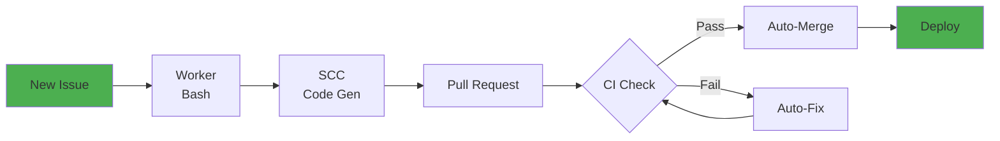

# AI-SDLC: Autonomous Software Development Lifecycle

Sistema autónomo de desarrollo que gestiona el ciclo completo de issues en GitHub desde admission hasta deployment:

**admission** → **planning** → **implementation (SCC)** → **PR creation** → **CI remediation** → **auto-merge** → **deployment verification**

## Estado Actual

- **Validación actual (2026-09-15)**: los pilotos recientes no completaron el flujo hasta producción; no hay una tasa de autonomía ni un tiempo E2E verificados.
- **Runtime**: worker Bash y servicios en contenedores Podman; CI/CD sujeto a disponibilidad del registro y reglas de revisión.
- **Próximo diseño**: pasos acotados y reanudables, validación independiente y evidencia de producción. Es una propuesta incremental, todavía no implementada.

Consulta la [decisión de diseño y sus criterios de promoción](docs/architecture/adr/0003-bounded-evidence-based-delivery.md) y la [evidencia de los pilotos](docs/worker-validation-toolchain.md). Las cifras históricas no constituyen garantías actuales.

## 📐 Architecture

Visual diagrams of system design, workflow, and deployment:

**[→ Architecture Documentation](docs/architecture/README.md)**

- **Component Architecture**: All services and their interactions
- **Autonomous Workflow**: End-to-end flow from issue to deployment
- **State Machine**: Issue lifecycle and transitions
- **Deployment Architecture**: Container orchestration and VPS setup
- **Data Flow**: Sequence diagrams of component interactions

Quick preview:



## Componentes

### 1. Worker Bash (Producción)

Worker autónomo que implementa el ciclo completo:

- **Script principal**: [`platform/scripts/homedir-sdlc-worker.sh`](platform/scripts/homedir-sdlc-worker.sh) (2,476 líneas)
- **Políticas**: [`platform/config/autonomous-decision-policy.yaml`](platform/config/autonomous-decision-policy.yaml) (723 líneas)
- **Deployment**: VPS con systemd timer
- **State**: Filesystem-based JSON + event journal JSONL
- **Integración**: GitHub CLI + SCC (Software Construction Copilot)

### 2. Dashboard Observabilidad

Aplicación Quarkus standalone para monitoreo en tiempo real (puerto 8081)

### 3. Arquitectura Futura (Go)

Prototipo de microservicios en [`future-go/`](future-go/) con 4 componentes: admission-controller, orchestrator, worker, release-manager.

## Quick Start

### 🚀 Production Deployment (Recommended)

**Fully automated containerized deployment via CI/CD:**

```bash
# 1. Configure GitHub Secrets (one-time)
# Go to: Settings → Secrets → Actions
# Add: VPS_HOST, VPS_USER, VPS_SSH_KEY
# See: docs/deployment/github-secrets-setup.md

# 2. One-time VPS setup (run as root on VPS)
curl -fsSL https://raw.githubusercontent.com/os-santiago/homedir-ai-sdlc/main/scripts/vps-initial-setup.sh | bash

# 3. Configure worker secrets in VPS
vim /etc/homedir-sdlc/worker.env
# Add: GH_TOKEN, SC_API_KEY

# 4. Deploy: Push to main branch
git push origin main
# → Automatic build → Push to ghcr.io → Deploy to VPS ✨
```

**Key benefits:**
- ✅ Immutable deployments (Git commit = Container version)
- ✅ Instant rollback (pull previous image)
- ✅ Zero manual steps after initial setup
- ✅ All dependencies bundled in container

See complete guide: **[docs/deployment/containerized-deployment.md](docs/deployment/containerized-deployment.md)**

### 🧪 Local Development

```bash
# Build containers locally
podman build -f container/Containerfile.worker -t ai-sdlc-worker:dev .

# Run worker container
podman run --rm \
  -e GH_TOKEN=your_token \
  -e HOMEDIR_SDLC_REPO=os-santiago/homedir \
  -v $(pwd)/state:/var/lib/homedir-sdlc \
  ai-sdlc-worker:dev

# Run dashboard
cd dashboard/quarkus-app
./mvnw quarkus:dev
# Access: http://localhost:8081
```

### 📜 Legacy Deployment (Systemd)

**Note:** This method is deprecated. Use containerized deployment above.

<details>
<summary>Click to see legacy systemd deployment</summary>

```bash
# Bootstrap automático (requiere sudo)
curl -fsSL https://raw.githubusercontent.com/os-santiago/homedir-ai-sdlc/main/platform/scripts/homedir-sdlc-bootstrap.sh | sudo bash
```

See: [docs/deployment/vps-systemd.md](docs/deployment/vps-systemd.md) (deprecated)
</details>

### Dashboard Development

```bash
cd dashboard/quarkus-app
./mvnw quarkus:dev
# Access: http://localhost:8081/sdlc/dashboard/
```

## 📚 Cómo Usar el Sistema

### Crear Issues para el Flujo Autónomo

**[→ Getting Started: Crear Issues](docs/GETTING-STARTED.md)**

Esta guía completa explica:
- ✅ Formato requerido del issue (Description, Current state, Desired state, Acceptance Criteria)
- ✅ Labels obligatorios: `ready-to-implement` + `priority:P3` (o P1/P2)
- ✅ Ejemplos de issues (bug fix simple, feature request, documentación)
- Secuencia objetivo del flujo; los tiempos históricos no son garantías actuales
- ✅ Mejores prácticas (principio ADEV, criterios verificables, atomicidad)
- ✅ Troubleshooting (issue no procesado, worker marcó needs-human, etc.)

**Flujo objetivo (sin duración garantizada):**
```
Requerimiento listo → admisión → implementación → validación
→ PR y revisiones requeridas → CI → despliegue → verificación de producción
```

Los fallos de capacidad, las validaciones y las revisiones pueden detener el flujo. Un PR mergeado no prueba por sí solo que la funcionalidad esté operativa en producción.

## 🤝 Contributing

### Branch Protection & PR Workflow

The `main` branch is protected to ensure code quality and stability:

**Protection Rules:**
- ✅ **Pull Requests Required**: Direct pushes to `main` are blocked
- ✅ **CI Checks Required**: `CI / events-service` must pass before merge
- ✅ **Applies to Admins**: Everyone follows the same workflow
- ✅ **No Force Pushes**: History integrity is enforced

**Contribution Workflow (ADEV):**

```bash
# 1. Create an issue first
gh issue create --title "feat: add new feature" --body "Description..."

# 2. Create branch from issue
git checkout -b feat/issue-N-feature-name

# 3. Make changes and commit
git add .
git commit -m "feat: add new feature

Closes #N"

# 4. Push and create PR
git push origin feat/issue-N-feature-name
gh pr create --title "feat: add new feature" --body "Closes #N"

# 5. Wait for CI to pass
# CI runs automatically on PR creation
# Check status: gh pr checks

# 6. Merge when green
gh pr merge --merge --delete-branch
```

**CI Requirements:**
- All PRs must pass `CI / events-service` check
- Build and tests must complete successfully
- Cannot merge with failing CI

**Quality Standards:**
- Follow conventional commits: `feat:`, `fix:`, `docs:`, `ci:`, etc.
- Link PRs to issues with `Closes #N`
- One feature/fix per PR
- Update documentation for user-facing changes

### Running Tests Locally

```bash
# Events Service (Java/Quarkus)
cd events-service
./mvnw clean test

# Worker (Bash)
cd platform/scripts
./run-tests.sh
```

### Development Setup

See [docs/development/](docs/development/) for detailed development guides.

## Historia

Este sistema fue desarrollado originalmente en el monorepo [os-santiago/homedir](https://github.com/os-santiago/homedir) y migrado a repositorio independiente el **2026-07-31** para evitar acoplamientos con la aplicación principal.

Ver [docs/history/](docs/history/) para reportes detallados de sesiones y evolución del sistema.
