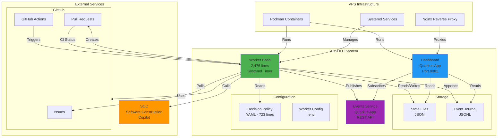
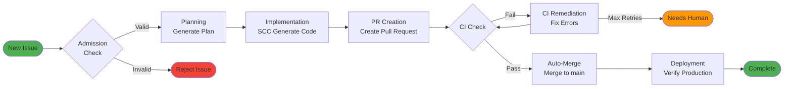
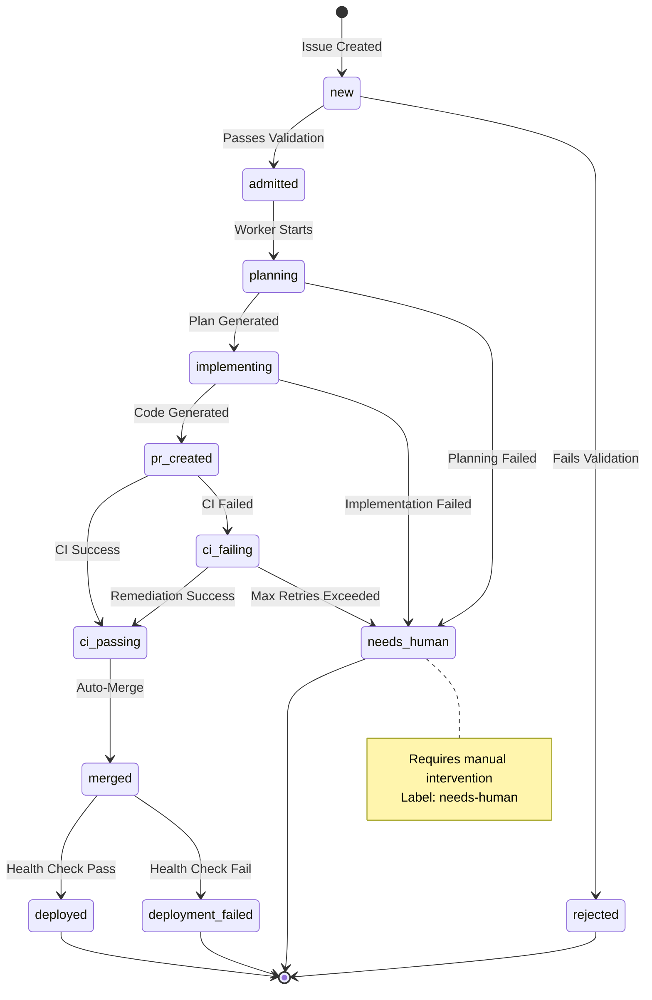
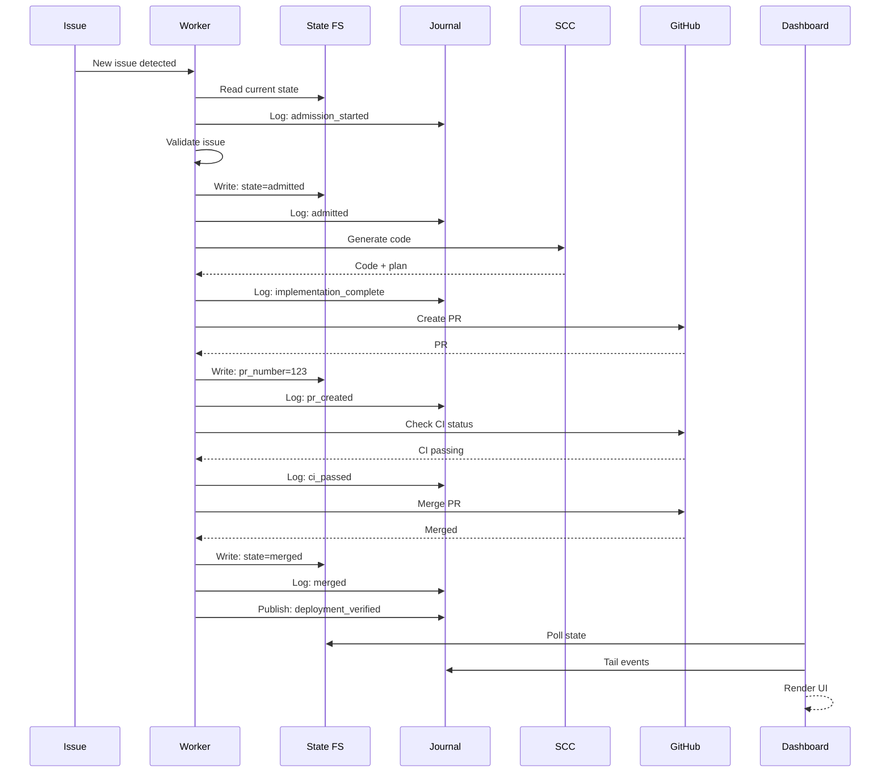

# AI-SDLC Architecture

Sistema autónomo de desarrollo que gestiona el ciclo completo de issues en GitHub desde admission hasta deployment.

## Overview

AI-SDLC automatiza el flujo completo de desarrollo:
- **Admission:** Valida y acepta issues para procesamiento autónomo
- **Planning:** Genera plan de implementación
- **Implementation:** Usa SCC para generar código
- **PR Creation:** Crea pull request con cambios
- **CI Remediation:** Corrige errores de CI automáticamente
- **Auto-Merge:** Mergea cuando CI pasa
- **Deployment:** Verifica deployment en producción

**Autonomía actual:** 99%  
**Tiempo E2E:** 16-20 minutos (issue → merged → deployed)

---

## Component Architecture



---

## Autonomous Workflow



**Typical Timeline:**
- 00:00 - Issue created
- 00:03 - Admitted
- 00:06 - Implementation complete
- 00:15 - PR created
- 00:19 - CI passed
- 00:20 - Merged & Deployed

---

## State Machine

Complete issue lifecycle with state transitions:



**State Descriptions:**

| State | Description | Next Actions |
|-------|-------------|--------------|
| `new` | Newly created issue | Validation check |
| `admitted` | Accepted for processing | Start planning |
| `planning` | Generating implementation plan | Execute plan |
| `implementing` | SCC generating code | Create PR |
| `pr_created` | Pull request created | Wait for CI |
| `ci_failing` | CI checks failing | Remediate or escalate |
| `ci_passing` | All CI checks passed | Auto-merge |
| `merged` | PR merged to main | Verify deployment |
| `deployed` | Verified in production | Complete |
| `needs_human` | Requires manual intervention | Human resolves |
| `rejected` | Invalid issue format | No action |

---

## Deployment Architecture

Infrastructure and CI/CD pipeline:

```mermaid
graph TB
    subgraph "GitHub"
        Repo[Repository<br/>homedir-ai-sdlc]
        GHCR[GitHub Container<br/>Registry]
    end

    subgraph "CI/CD Pipeline"
        Push[Push to main]
        Build[Build Containers<br/>Worker + Dashboard]
        Publish[Publish to GHCR]
    end

    subgraph "VPS: 72.60.141.165"
        subgraph "Podman Containers"
            WorkerC[ai-sdlc-worker<br/>Latest]
            DashC[ai-sdlc-dashboard<br/>Latest]
        end
        
        subgraph "Systemd Services"
            WorkerTimer[homedir-sdlc-worker.timer<br/>Every 3 min]
            DashService[homedir-sdlc-dashboard.service<br/>Always running]
        end
        
        subgraph "Storage"
            WorkData[/var/lib/homedir-sdlc]
            Logs[/var/log/homedir-sdlc]
        end
        
        NginxVPS[Nginx<br/>:443]
    end

    subgraph "External Access"
        Browser[Browser<br/>Dashboard UI]
        API[API Clients]
    end

    %% CI/CD Flow
    Repo -->|git push| Push
    Push -->|trigger| Build
    Build -->|push images| Publish
    Publish --> GHCR

    %% Deployment Flow
    GHCR -->|podman pull| WorkerC
    GHCR -->|podman pull| DashC
    
    %% Runtime
    WorkerTimer -->|executes| WorkerC
    DashService -->|runs| DashC
    
    WorkerC -->|reads/writes| WorkData
    DashC -->|reads| WorkData
    
    WorkerC -->|logs| Logs
    DashC -->|logs| Logs
    
    NginxVPS -->|proxy :8081| DashC
    
    Browser -->|HTTPS| NginxVPS
    API -->|HTTPS| NginxVPS

    style WorkerC fill:#4CAF50
    style DashC fill:#2196F3
    style GHCR fill:#9C27B0
```

**Deployment Flow:**
1. Developer pushes to `main`
2. GitHub Actions builds containers
3. Publishes to GHCR
4. VPS pulls latest images
5. Systemd restarts services with new containers

---

## Data Flow

Sequence of interactions during autonomous workflow:



---

## Technology Stack

| Layer | Technology | Purpose |
|-------|-----------|---------|
| **Worker** | Bash + gh CLI + jq | Autonomous workflow orchestration |
| **Dashboard** | Quarkus 3.x + Qute | Real-time monitoring UI |
| **Events** | Quarkus + SSE | Event streaming |
| **Storage** | JSON + JSONL | State persistence |
| **AI** | SCC (Software Construction Copilot) | Code generation |
| **Container** | Podman | Containerization |
| **Orchestration** | Systemd timers | Scheduling |
| **Proxy** | Nginx | Reverse proxy + SSL |
| **VPS** | Ubuntu 24.04 | Host OS |

---

## Directory Structure

```
homedir-ai-sdlc/
├── platform/
│   ├── scripts/
│   │   └── homedir-sdlc-worker.sh          # Main worker (2,476 lines)
│   └── config/
│       └── autonomous-decision-policy.yaml # Policy (723 lines)
├── dashboard/
│   └── quarkus-app/                        # Dashboard UI
├── events-service/                         # Events API
├── container/
│   ├── Containerfile.worker                # Worker container
│   └── Containerfile.dashboard             # Dashboard container
├── docs/
│   ├── architecture/                       # This directory
│   ├── deployment/                         # Deployment guides
│   └── development/                        # Dev guides
└── state/                                  # Runtime state (gitignored)
    ├── current-state.json
    └── events.jsonl
```

---

## Further Reading

- [Getting Started](../GETTING-STARTED.md) - How to use the system
- [Development](../development/) - Contributing guide

---

**Last Updated:** 2026-08-28  
**Version:** Production (Podman deployment)
