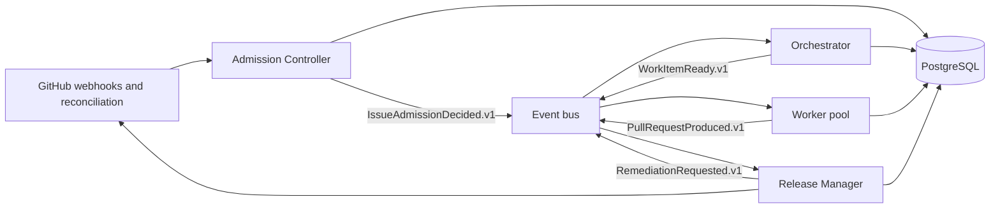

# Architecture

HomeDir AI SDLC is a control plane composed of four bounded components. It uses
asynchronous commands/events and reconciliation rather than synchronous
component call chains.



## Deployment boundaries

Each component has:

- its own OCI image and runtime identity;
- its own GitHub App permission profile;
- explicit consumed and produced contracts;
- independent readiness and telemetry;
- no direct access to another component's filesystem.

The initial small-footprint topology co-locates all four containers in one pod.
Co-location is not a code boundary: the worker can later be scaled as a separate
deployment without changing contracts.

## State model

PostgreSQL is authoritative for workflow state, leases, the append-only audit
log and an event outbox. GitHub remains authoritative for repositories, issues,
PRs, checks and deployments. Controllers continuously reconcile these systems.

Publishing state changes and events uses the transactional outbox pattern.
Work spanning GitHub, CI and production is a saga with explicit compensation,
not an ACID transaction.

## Repository integration

Managed repositories provide:

```text
.ai-sdlc/
├── repository.yaml
├── admission-policy.yaml
├── quality-gates.yaml
├── release-policy.yaml
└── architecture-rules.yaml
```

Organization defaults cannot be weakened by repository policy.
