# ADR 0003: Bounded delivery with independently verified evidence

- Status: Proposed; execution changes require separate reviewed increments
- Date: 2026-09-15
- Tracking: #73
- Goal: accepted requirements become functional, verified production changes.

## Evidence and limits

The September pilots establish authenticated repository editing, not reliable
autonomous delivery. Poolside returned capacity HTTP 503 twice. A Lightning
canary edited a file in 67 seconds, but Homedir #1564 exhausted 1500 seconds after
adding five title attributes without the required CSS or validation. Its patch
was preserved manually. See [the recorded evidence](../../worker-validation-toolchain.md).

`run_initial_implementation` currently gives generation and subsequent validation
one shared deadline. Complexity is inferred from acceptance-checkbox count, not
repository scope. There is no durable lifetime budget across retries. The CLI
timeout repair in sc-agent-cli #397 closes a response-body cancellation defect;
it does not prove why the complete pilot stalled or that this model can reliably
complete arbitrary requirements. The worker image now pins that merged repair.

`release_status_for_pr` currently recognizes a successful Production Release run
for the merge SHA. This is useful evidence, but the worker does not independently
verify the served revision and feature behavior. The inspected homedir-infra
`scripts/deploy-app.sh` replaces one container and can restore a previous image;
this is not evidence of uninterrupted availability. Runtime topology must be
checked before any release change; repository manifests alone are insufficient.

Existing ADRs define four component boundaries and a future PostgreSQL/outbox
design. The production Bash worker still owns the active path. This ADR stages
their realization rather than introducing a second production orchestrator.
Historical autonomy percentages and fixed delivery-time promises are not current
service objectives or measured guarantees.

## Options

| Option | Evidence/tradeoff | Decision |
| --- | --- | --- |
| Increase timeout for one whole-issue agent run | Already reaches 25 minutes without complete evidence; loses verification budget | Reject as the primary strategy |
| Replace the model or use a hosted coding executor | May improve latency and competence, but requires repository benchmarks, capacity, cost and data-handling checks | Support behind an executor adapter; no provider assumed qualified |
| Bounded edits with durable state and deterministic gates | Reuses CLI and existing CI; makes failures recoverable and separates model quality from orchestration | Preferred next implementation |
| Rewrite immediately as distributed agents/microservices | Adds coordination and operating cost before proving one delivery lane | Defer; retain existing component boundaries |
| Deterministic recipes for repetitive changes | Reliable within a narrow contract; cannot resolve arbitrary issues | Complement the model lane, using the same validation and release gates |

Autonomy is a property of the delivery system, not an unrestricted model session.
The model proposes plans and patches; trusted code owns transitions, credentials,
budgets, validators and release decisions. Requirements outside the qualified
capability envelope are decomposed or escalated with evidence, never marked done.

## Stage contracts

The following states are proposed, not existing worker capabilities:

```mermaid
flowchart LR
  R[Requirement] --> A[Admission and scope]
  A --> P[Versioned plan]
  P --> E[Bounded edit]
  E --> V[Independent validation]
  V -->|specific failure, budget remains| E
  V --> PR[PR and required reviews]
  PR --> C[Candidate artifact]
  C --> D[Production promotion]
  D --> O[Revision and behavior observation]
  O --> Done[Verified production delivery]
```

Every transition records run ID, requirement revision/hash, base SHA, plan version,
step ID, attempt, policy version, start/end timestamps, outcome and artifact hashes.
External API failures become pending/retryable states, not false completions.
Only trusted validators can advance a validated step; a model's success prose
or exit zero is insufficient.

1. **Admission:** verify issue readiness, duplicate/active PRs, risk and testability.
   Produce explicit allowed paths, excluded scope and acceptance-to-test mapping.
   Count semantic changes and dependencies rather than acceptance checkboxes.
2. **Plan:** cap the initial lane at three sequential edits. Each step declares
   its inputs, permitted paths, expected observable behavior and validator ID.
   Reject plans with untestable acceptance or scope outside the approved lane.
3. **Execute:** provide only relevant repository context, immutable requirements,
   previous verified artifacts and the latest structured failure. Return a patch
   and diagnostics. The orchestrator owns checkout, branch, commit and publication.
4. **Validate:** apply the patch to an isolated candidate at the recorded base;
   check path limits, secret/security findings, diff integrity and the union of
   required validators for all changed file types. Validator commands come from
   trusted, versioned policy, never executable text supplied by the issue/model.
   UI changes require browser evidence at the stated viewports; Maven alone does
   not prove absence of visual overflow. Unknown validation mapping pauses work.
5. **Publish/review:** one PR per logical requirement; link acceptance evidence to
   its exact head SHA. CI remediation consumes the same lifetime attempt ledger.
   Revalidate changed heads and retain existing human/code-owner approvals.
6. **Release:** promote an immutable artifact built from the approved merge SHA
   through the existing release authority. The coding executor cannot deploy.
7. **Observe:** verify served revision, health, a feature-specific synthetic check
   and an observation window before recording production success. A successful
   workflow alone does not complete this stage.

## Initial budgets and recovery

These are conservative pilot hypotheses to measure, not latency promises:

| Limit | Initial candidate policy |
| --- | --- |
| Active implementation | One run per repository; no competing historical replay |
| Model request deadline | 120 seconds including headers/body, bounded by remaining step budget |
| Edit attempt | 5 minutes; at most two attempts per step |
| Plan | At most three steps; larger requests require a new decomposition |
| Validation reserve | Separate 10-minute envelope; generation cannot consume it |
| Lifetime active work | 45 minutes across planning, retries, editing and validation |
| Capacity failures | At most two delayed probes (60/180 seconds); then pause provider lane |
| Waiting for CI/review/provider | Persisted wait; distinct from active compute; expire after 24 hours into explicit escalation |

Benchmark results can justify policy revisions. A slow qualified executor may use
a different reviewed budget, never silently unlimited execution. Bound tokens and
spend where the provider reports usage; missing price/usage data is unknown, not
zero cost. Record model, CLI SHA, request latency, body completion, tool duration,
timeout phase and attempt count without logging credentials or raw prompts.

Before timeout, cancellation or retry, persist tracked and untracked candidate
changes as an untrusted artifact with manifest and checksums. Never infer a valid
checkpoint from a partial patch. Restart restores the last validated step in a
fresh worktree; partial edits may be offered as context or revalidated explicitly.
Changed requirements/base invalidate dependent evidence. Do not blindly apply a
stale patch. A new base requires a fresh application and relevant validation.

Start with a single-writer journal, atomic file replacement and a repository lock.
Record intent before publication; reconcile by run/branch/PR before retrying after
a crash. Test crash windows before claiming duplicate prevention. Move authoritative
state to the existing PostgreSQL/outbox boundary only when multiple workers are
needed; avoid dual state authorities or claims of exactly-once external delivery.

## Security and availability boundaries

The current permission config allows shell, git and file writes, and the worker
environment holds publication credentials. Prompt instructions and denyPaths are
not a sandbox. The new lane must run code generation and candidate tests in an
ephemeral restricted container: non-root, resource limits, no host/container socket,
no SSH/deployment/GitHub-write credentials, no production data, and no shared
credential-bearing home directory. Enforce provider access through a constrained
gateway or narrowly scoped short-lived credential; restrict network egress.
Tests are untrusted code too. A separate publisher accepts validated artifacts
and alone holds narrowly scoped repository-write authority. Preserve repository
security checks and review requirements. Modifications to policy, workflows,
authentication, secrets, migrations and SDLC self-modification require the higher
risk lane and human review; the agent cannot edit its own release authority.

Keep the current Homedir release running while the new SDLC lane is qualified.
Use read-only/shadow runs first; only one lane may publish for a requirement.
Disabling the new lane must preserve its evidence and let existing reconciliations
finish. Do not copy failed candidates into the production checkout.

For service continuity, prove readiness before traffic switching and keep the
last known-good artifact. Before adopting two simultaneous app instances, inspect
shared-file/data writes, session behavior and migration compatibility: blue/green
is not safe by assumption. Infrastructure owns that assessment. Initially exclude
data migrations from the autonomous lane. Automate rollback only for a tested,
backward-compatible artifact switch; destructive data rollback needs a separate
recovery plan. Health checks do not establish zero downtime or safe data rollback.

## Component ownership

| Component | Responsibility |
| --- | --- |
| homedir | User requirements, acceptance behavior, application tests and delivered features |
| homedir-ai-sdlc | Durable delivery state, bounded scheduling, executor adapters and evidence |
| sc-agent-cli | Replaceable patch executor with reliable cancellation and structured diagnostics |
| homedir-infra | Runtime isolation, secrets delivery, artifact promotion, availability and recovery |
| homedir-idp | Future identity/policy integration through versioned contracts; no parallel deployment authority |
| Joidy / Artemisa | Candidate requirement/context producers; inspect actual interfaces before integration |

One requirement/run identifier should connect these components. Their integration
must not be a prerequisite to proving one Homedir delivery lane, and this ADR
does not assert unverified Joidy/Artemisa capabilities.

## Ordered implementation and promotion gates

1. **Baseline (this PR):** correct claims, pin reviewed CLI and document this
   decision. This does not activate resumability, isolation or a new release path.
2. **Durable bounded executor:** introduce run/step manifests, artifact preservation,
   lifetime budgets and crash recovery behind a disabled-by-default flag. Test
   restart after edit, timeout with untracked files, duplicate notification,
   provider outage and stale base. Success means no lost evidence or duplicate PR
   in fault-injection tests, not an increased timeout.
3. **Isolation and independent validation:** enforce credential/process boundaries,
   allowed paths and validator selection for mixed changes. Prove attempted secret
   access, policy edits, out-of-scope patches and missing validators cannot advance.
4. **Executor qualification:** run the same ten low-risk, representative repository
   tasks against the repaired CLI and any candidate alternative. Include CSS/Qute,
   tests and scoped Java fixes. Record every failure, intervention, latency and
   compute cost. Initial gate: at least 8/10 fully validated patches within budget,
   zero bypasses and preserved evidence for all failures. This small sample permits
   a supervised pilot only; it does not establish enterprise reliability.
5. **Production proof:** deliver three low-risk changes through PR, required reviews,
   CI, immutable deployment, served-revision verification and feature smoke checks;
   observe each for 30 minutes and rehearse compatible rollback in a safe environment.
   Only then expand scope. Keep approvals until governance explicitly changes them.

Track accepted-to-verified-production rate with its denominator, first-pass
validation, interventions per delivery, provider failure rate, active/wait time,
rework, escaped defects and recovery time. Exclude neither failures nor stopped
runs. Distinguish routine required approvals from engineering rescue work. A
merged PR, a passed canary and a healthy existing deployment are separate facts.
