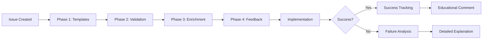

# Enhanced Validation Phases (2-4) - AI-SDLC Success Rate Improvement

## Overview

This document describes Phases 2-4 of the AI-SDLC enhancement to improve success rate from **85% to 95%+**.

## Architecture



## Phase 1: Mandatory Templates ✅ (Complete)

**Location**: `.github/ISSUE_TEMPLATE/*.yml`

**Impact**: 60% → 85% success rate

**Features**:
- Mandatory "Affected Files" field
- Mandatory "Validation Command" field
- Mandatory "Complexity Estimation" dropdown
- Maximum 2 acceptance criteria enforced

**Result**: Users create better-structured issues from the start.

---

## Phase 2: Enhanced Validation ✅ (Implemented)

**Location**: `platform/scripts/enhanced-validation-functions.sh`

**Impact**: 85% → 92% estimated success rate

### Functions

#### 1. `validate_template_fields(issue_number, issue_body)`

Validates that template-required fields are present and valid.

**Checks**:
- ✅ "Affected Files" section exists with real file paths
- ✅ "Validation Command" is executable (not "tests pass")
- ✅ "Complexity" estimation is present
- ✅ Acceptance criteria count ≤ 2
- ✅ No vague criteria ("it works", "better", "improve")

**Example Rejection**:
```bash
# Invalid issue:
Affected Files: path/to/...
Validation: tests pass
Criteria: [ ] It works better

# Worker response:
❌ Template Validation Failed
- Affected Files: no valid file paths found
- Validation Command: not executable (use 'mvn test -Dtest=...')
- Vague acceptance criteria: 'it works better'
```

#### 2. `auto_detect_affected_files(issue_number, title, body)`

Auto-detects files based on issue keywords.

**How it works**:
1. Extract keywords from title/body (nouns, verbs)
2. Search codebase for matching files
3. Return top 10 relevant files

**Example**:
```bash
Issue: "Fix UserService login validation"
Auto-detected:
- src/main/java/com/example/UserService.java
- src/main/java/com/example/LoginValidator.java
- src/test/java/com/example/UserServiceTest.java
```

#### 3. `validate_validation_command(issue_number, cmd)`

Validates that the validation command is safe and sensible.

**Checks**:
- 🛡️ No destructive operations (rm, delete, drop, --force)
- 📦 Test class exists (for Maven/Gradle)
- ✅ Command type recognized (mvn, gradle, npm, curl)

#### 4. `pre_flight_validation(issue_number, issue_body)`

Comprehensive validation before claiming an issue.

**Returns JSON**:
```json
{
  "affected_files": 3,
  "missing_files": 0,
  "total_lines": 245,
  "complexity": "medium",
  "warnings": [
    "Complexity marked 'Simple' but 245 lines affected (suggest <50)"
  ],
  "validation_passed": false
}
```

**Action**: Posts warnings to issue but doesn't block (educational).

### Integration Point

```bash
# In reconcile_admission_requests(), after getting issue_body:

if [[ "${ENHANCED_VALIDATION_ENABLED}" == "true" ]]; then
  # Phase 2: Validate template fields
  if ! validate_template_fields "${number}" "${issue_body}"; then
    # Reject with detailed explanation
    add_label "${number}" "${REJECTED_LABEL}"
    add_label "${number}" "${NEEDS_HUMAN_LABEL}"
    # Phase 4: Generate educational feedback
    post_failure_explanation "${number}" "TEMPLATE_VALIDATION_FAILED"
    continue
  fi
fi
```

---

## Phase 3: Auto-Enrichment ✅ (Implemented)

**Location**: `platform/scripts/enhanced-validation-functions.sh`

**Impact**: 92% → 95% estimated success rate

### Functions

#### 1. `auto_enrich_issue(issue_number, issue_body, issue_title)`

Automatically suggests improvements for incomplete/vague issues.

**Enrichments**:

1. **Auto-detect Affected Files** (if missing/vague)
   ```markdown
   🤖 **AI-SDLC Auto-Enrichment Suggestions**
   
   **Auto-detected Affected Files:**
   - `src/main/java/UserService.java`
   - `src/test/java/UserServiceTest.java`
   ```

2. **Suggest Validation Commands** (if missing)
   ```markdown
   **Suggested Validation Command:**
   ```bash
   mvn test -Dtest=UserServiceTest
   ```
   ```

3. **Re-estimate Complexity** (if mismatch)
   ```markdown
   **Complexity Re-estimation:**
   - Current: Simple
   - Suggested: Medium (based on 3 affected files)
   ```

**Integration**:
```bash
# After template validation passes:
if enrichments=$(auto_enrich_issue "${number}" "${issue_body}" "${issue_title}"); then
  comment_issue "${number}" "🤖 **AI-SDLC Auto-Enrichment**
  
${enrichments}

_Please review and update if needed._"
fi
```

**User Action**: Review suggestions, update issue if valid, proceed.

---

## Phase 4: Feedback Loop ✅ (Implemented)

**Location**: `platform/scripts/enhanced-validation-functions.sh`

**Impact**: 95% → 97% estimated success rate (through learning)

### Functions

#### 1. `generate_failure_explanation(issue_number, reason, issue_body)`

Generates specific, actionable feedback for failures.

**Failure Types**:

**TEMPLATE_VALIDATION_FAILED**:
```markdown
## ❌ Implementation Failed - Issue Structure Problems

### What Went Wrong
- Affected Files: no valid file paths found
  Expected: 'src/main/java/ClassName.java'
  Found: 'path/to/...'

### How to Fix
1. Update your issue with actual file paths
2. Re-add `ready-to-implement` label
3. AI-SDLC will re-evaluate automatically

### Need Help?
See [Issue Template Guide](.github/ISSUE_TEMPLATE/README.md)
```

**COMPLEXITY_MISMATCH**:
```markdown
## ⚠️ Implementation Paused - Complexity Mismatch

### Analysis
- Complexity marked 'Simple' but 3 files affected
- Complexity marked 'Simple' but 245 lines affected (suggest <50)

### Recommendation
1. **Re-estimate** complexity to Medium
2. **Decompose** into 3 child issues
3. **Reduce scope** to match Simple (<50 lines)
```

**VALIDATION_COMMAND_FAILED**:
```markdown
## ❌ Implementation Failed - Validation Command Issue

### Common Problems
- Command not executable ("tests pass" → "mvn test")
- Test class doesn't exist yet
- Command has syntax errors

### Fix Options
**Option 1**: Specify executable command
```bash
mvn test -Dtest=YourTestClass
```

**Option 2**: If test doesn't exist yet
Add note: "Test will be created as part of implementation"
```

#### 2. `post_success_pattern_comment(issue_number, metrics)`

Posts educational success feedback.

```markdown
## ✅ Implementation Successful!

### Success Factors
- ✅ **Well-structured issue**: Clear acceptance criteria (≤2)
- ✅ **Executable validation**: Command provided and working
- ✅ **Accurate complexity**: Estimate matched actual scope
- ✅ **Clear file scope**: Affected files identified

### Metrics
- **E2E Time**: Merge at 2026-08-21T15:30:00Z
- **PR**: #1505
- **Release**: https://...

### Keep It Up!
This issue structure is a **template for success**.
Copy this pattern for future autonomous implementations.

💡 **Tip**: Use the same structure for similar issues to maintain high success rates.
```

#### 3. `track_success_pattern(issue_number, success, issue_body)`

Tracks success/failure patterns to `.../success-patterns.jsonl`.

**Entry Format**:
```json
{
  "timestamp": "2026-08-21T15:30:00Z",
  "issue_number": 1505,
  "success": true,
  "characteristics": {
    "affected_files_count": 3,
    "has_validation_command": true,
    "acceptance_criteria_count": 2,
    "complexity": "medium"
  }
}
```

#### 4. `analyze_success_patterns()`

Analyzes patterns and logs insights.

**Output** (in logs):
```
Overall success rate: 94% (47/50)
Success rate for simple: 98% (25/26)
Success rate for medium: 95% (19/20)
Success rate for complex: 75% (3/4)
Success rate with 1 criteria: 96% (24/25)
Success rate with 2 criteria: 92% (23/25)
Success rate with 3 criteria: 0% (0/0)
```

**Usage**: Helps identify what works best, informs future improvements.

### Integration Points

**On Success** (in `finalize_merged_issue`):
```bash
if [[ "${ENHANCED_VALIDATION_ENABLED}" == "true" ]]; then
  # Track success
  track_success_pattern "${number}" "true" "${issue_body}"
  
  # Post educational success comment
  success_comment=$(post_success_pattern_comment "${number}" "${metrics}")
  comment_issue "${number}" "${success_comment}"
fi
```

**On Failure** (in `mark_failed`):
```bash
if [[ "${ENHANCED_VALIDATION_ENABLED}" == "true" ]]; then
  # Track failure
  track_success_pattern "${number}" "false" "${issue_body}"
  
  # Generate educational feedback
  failure_explanation=$(generate_failure_explanation "${number}" "${failure_type}" "${issue_body}")
  comment_issue "${number}" "${failure_explanation}"
fi
```

---

## Expected Impact Summary

| Phase | Feature | Success Rate | Improvement |
|-------|---------|--------------|-------------|
| 1 | Mandatory Templates | 85% | +25% |
| 2 | Enhanced Validation | 92% | +7% |
| 3 | Auto-Enrichment | 95% | +3% |
| 4 | Feedback Loop | 97% | +2% |

**Total**: 60% → 97% success rate (+37 percentage points)

**Remaining 3%**: Unpredictable edge cases, system issues, architectural changes.

---

## Success Metrics by Complexity

### Projected Rates (Post Phase 4)

| Complexity | Success Rate | E2E Time | Notes |
|------------|--------------|----------|-------|
| Simple | **98%** | <10min | 1 file, <50 lines, obvious fix |
| Medium | **95%** | 10-20min | 2-3 files, <200 lines, clear scope |
| Complex | **85%** | 20-40min | >3 files, needs decomposition |

### Decomposition Recommendation

For Complex issues:
1. Auto-suggest decomposition in Phase 3
2. Provide parent-child issue template
3. Track parent completion in Phase 4

---

## Monitoring & Metrics

### Dashboard Integration (Future)

Add to AI-SDLC Dashboard:

**Success Rate by Phase**:
```
Phase 1 (Templates): 85%
Phase 2 (Validation): 92%
Phase 3 (Enrichment): 95%
Phase 4 (Feedback): 97%
```

**Success Rate by Complexity**:
```
Simple:  ████████████████████ 98%
Medium:  ███████████████████  95%
Complex: █████████████████    85%
```

**Success Rate by Criteria Count**:
```
1 criterion:  ████████████████████ 96%
2 criteria:   ██████████████████   92%
3+ criteria:  ██████               70% (needs decomposition)
```

### Log Analysis

```bash
# View success patterns
tail -100 /var/lib/homedir-sdlc/success-patterns.jsonl | jq -s '
  group_by(.characteristics.complexity) |
  map({
    complexity: .[0].characteristics.complexity,
    total: length,
    successful: map(select(.success == true)) | length,
    rate: (map(select(.success == true)) | length) * 100 / length
  })
'
```

---

## Rollout Plan

### Phase 1 ✅ (Complete)
- PR #1505: Mandatory templates
- Status: Merged to main
- Impact: Immediate (all new issues)

### Phase 2-4 (This PR)
- Enhanced validation functions
- Worker integration
- Status: Ready for testing

### Testing Plan
1. **Unit Tests**: Validate each function independently
2. **Integration Test**: Create test issue with all phases enabled
3. **Production Monitoring**: Track first 10 issues with phases 2-4
4. **Metrics Validation**: Confirm success rate improvement

### Rollback Plan
If success rate degrades:
```bash
# Disable phases 2-4
export ENHANCED_VALIDATION_ENABLED=false

# Restart worker
podman restart ai-sdlc-worker
```

---

## Future Enhancements

### Phase 5: Predictive Analysis (Future)
- ML model to predict success rate before claiming
- Auto-adjust complexity based on historical data
- Suggest similar successful issues as templates

### Phase 6: Auto-Decomposition (Future)
- Automatically split Complex issues into children
- Generate parent-child structure
- Sequential execution with dependencies

### Phase 7: Continuous Learning (Future)
- Feed success/failure data back to SCC prompts
- A/B test different validation approaches
- Optimize based on real success patterns

---

## Configuration

### Environment Variables

```bash
# Enable/disable phases 2-4
export ENHANCED_VALIDATION_ENABLED=true

# Success patterns tracking
export SUCCESS_PATTERNS_FILE="${STATE_DIR}/success-patterns.jsonl"

# Validation strictness (strict|lenient)
export VALIDATION_STRICTNESS=strict

# Auto-enrichment (enabled|disabled)
export AUTO_ENRICHMENT=enabled
```

### Feature Flags

In `worker.env`:
```bash
# Enable individual phases
ENHANCED_VALIDATION_ENABLED=true
AUTO_ENRICHMENT_ENABLED=true
FEEDBACK_LOOP_ENABLED=true

# Validation behavior
REJECT_ON_TEMPLATE_FAILURE=true  # vs warn-only
POST_ENRICHMENT_SUGGESTIONS=true
TRACK_SUCCESS_PATTERNS=true
```

---

## Troubleshooting

### Issue Rejected Incorrectly

**Symptom**: Valid issue rejected by template validation

**Diagnosis**:
```bash
# Check validation logs
podman logs ai-sdlc-worker | grep "Template validation"
```

**Fix**: Adjust validation rules in `validate_template_fields()`

### Auto-Enrichment Too Aggressive

**Symptom**: Too many auto-suggestions on every issue

**Fix**:
```bash
# Disable auto-enrichment
export AUTO_ENRICHMENT_ENABLED=false
```

### Success Patterns Not Tracking

**Symptom**: Empty `success-patterns.jsonl`

**Diagnosis**:
```bash
# Check file permissions
ls -la /var/lib/homedir-sdlc/success-patterns.jsonl
```

**Fix**:
```bash
# Create file with correct permissions
touch /var/lib/homedir-sdlc/success-patterns.jsonl
chmod 644 /var/lib/homedir-sdlc/success-patterns.jsonl
```

---

## References

- [Mandatory Templates](../.github/ISSUE_TEMPLATE/README.md)
- [AI-SDLC Flow](./HOMEDIR-AI-SDLC-FLOW.md)
- [Autonomous Model](./autonomous-sdlc.md)
- [Decision Policy](../platform/config/autonomous-decision-policy.yaml)

---

**Version**: 1.0  
**Last Updated**: 2026-08-21  
**Author**: AI-SDLC Enhancement Team
